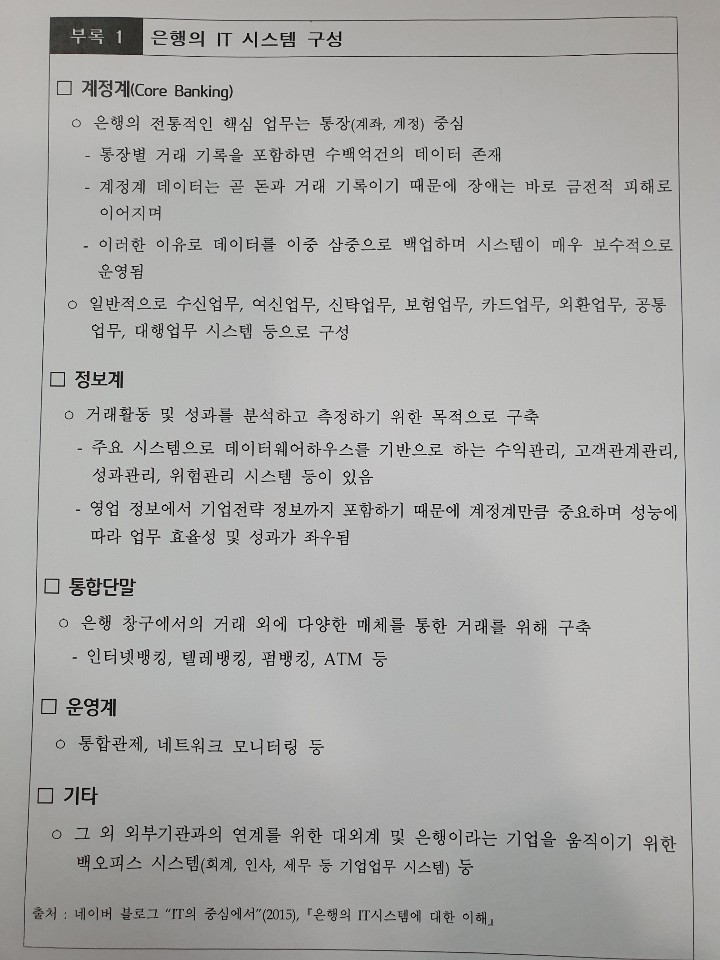
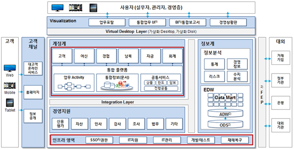
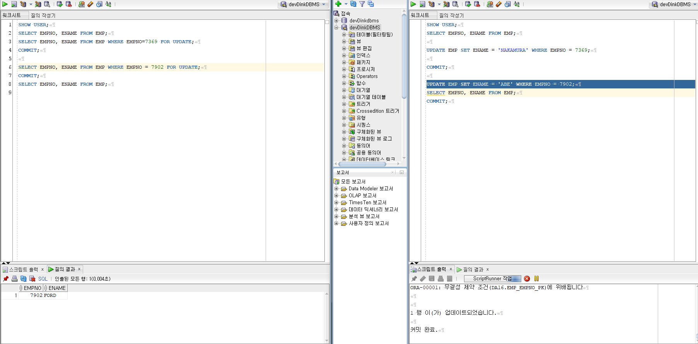
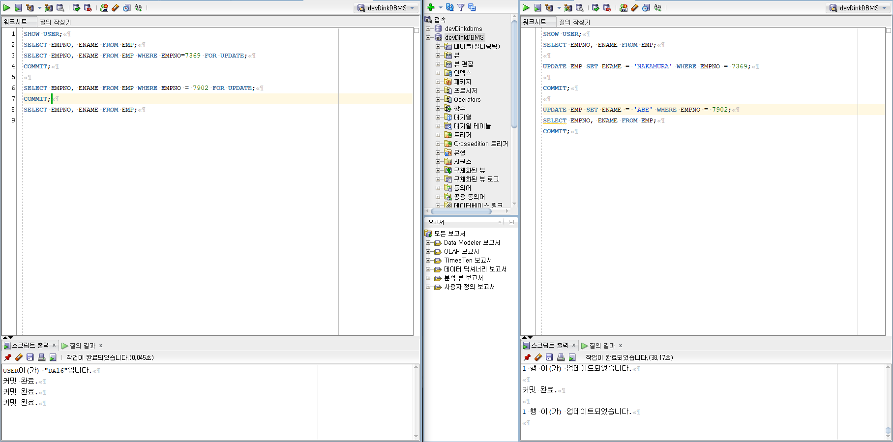
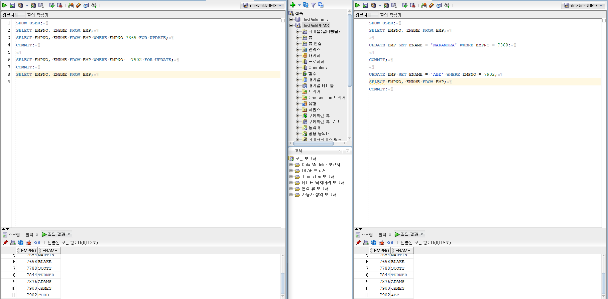
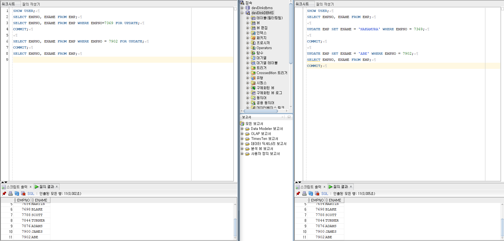
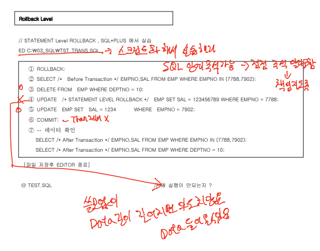
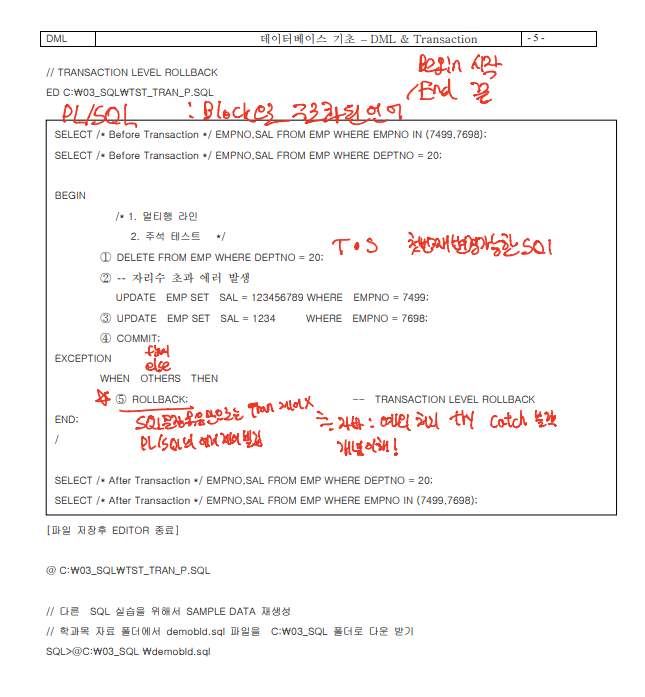

# 20.05.13 sql 과제

## 1 계정계 정보계 은행 IT 체계

- 계정계

  통장 = 계좌 = 계정 / 원장 = 근본이 되는 장부

  기본적으로 원장에 트랜잭션이 집중되는 구조이기 때문에,
  안정적으로 트랜잭션을 처리하기 위한 미들웨어Middleware가 발달해 있습니다.

  금융업에서 실시간으로 고객의 거래가 처리되는 시스템이다.

  통장/입출금/계좌이체 등의 업무들이 포함된다.

  가장 크리티컬하고 거대한 시스템이다.

- 정보계

  거래되는 데이터를 관리한다.

  OLAP(Online Analysis Processing) 처리를 목적으로 만들어진 시스템이다.

  계정계가 거래의 프로세스를 관리한다면 정보계는 거래가 되는 동안 발생되는 데이터를 다룬다.

  모은 데이터를 활용하여 예측/결산/분석등의 업무를 수행할 수 있다.

  흔히 데이터웨어하우스라고 부르는 시스템이 정보계 시스템의 중심입니다. 정보계에서 데이터로의 접근성에 대한 속도가 중요시되며 DW에 비해 정보를 저장하는 기간이 짧다는 것이 특징입니다.

  비교적 늦게 시작했기 때문에 Java 기반으로 구축된 곳이 많으며,
  최근에는 빅데이터기술도 많이 검토되고 있습니다.

- 기간계

  고객이 사용하던 기존 시스템.

  흔히 레거시 시스템(Legacy System)이라고 한다.

  1차적인 업무 거래를 행하여 자료가 쌓인 시스템이다.

  새로운 시스템을 도입하기 전의 기준이 되는 시점이라 할 수 있다.

- 운영계

  OLTP(OLTP:Online Transaction Processing)는 물류 시스템처럼 실시간 업데이트가 지속적으로 일어나는 운영데이터를 기반으로 움직이는 시스템으로, 즉시 처리 되는 시스템이다. 

  그래서 주로 시스템의 안정성과 정확성을 위주로 개발되어진다. .

- 대외계

  각 금융기관의 대내외망을 연결하는 시스템이다.

  전자금융/사이버증권/기업뱅킹 등의 외부적인 채널들을 통합적으로 관리하는 시스템이다

  





## 2  MERGE 구현

승원님!

## 3 SELECT FOR UPDATE

- ⓒ SELECT ~ FOR UPDATE 의 기능 및 트랜잭션 시작/종료를 설명 하십시요.

- 오라클은 행단위로 동시성 제어가 가능하다

- 특정한 테이블의 데이터 (ROW)에 대하여 순차적 DML 처리를 가능하도록 하고자 하는 경우 

- 동시성 제어를 위하여 특정 데이터(ROW)에 대해 베타적 LOCK을 거는 기능입니다.  

- 하나의 리소스를 놓고 여려 트랜잭션에서 SELECT 한 후 DML(INSERT,UPDATE,DELETE)로직을 처리하고자 할 때 먼저 SELECT 한 곳에서 LOCK을 걸고 TCL(COMMIT,ROLLBACK)하기 전에 다른세션에서는 SELECT 되지 못하세 하는 기능 

- ex - 좌석이나 티켓예매시, 동시접속자가 많아 둘 이상의 사람이 같은 자리를 동시에 선택하는 경우(동시 트랜잭션이 발생 하는 경우) 동시성 제어가 필요합니다

- EX - 은행의 예금 및 대출 통장의 잔액 변경의 일관성을 유지하고자 한다.

  ```sql
  SELECT ENAME FROM EMP WHERE DEPTNO = 20 FOR UPDATE;
  SELECT ENAME FROM EMP WHERE DEPTNO = 20 FOR UPDATE NOWAIT;
  -- SELECT 할 때 LOCK을 제어할 수 없으면 에러처리 
  SELECT ENAME FROM EMP WHERE DEPTNO = 20 FOR UPDATE WAIT 60;
  -- 지정한 시간만큼 LOCK을 제어하려고 재시도 후 에러처리
  ```

  **[시작]  - 첫번째 실행가능(변경가능한)한(EXECUTETABLE SQL) SQL 실행시**  변경불가능한 것은 SELECT 다른 SQL들을 BEGIN/END라는 구문이 있으나 오라클은 없어서 헷갈림 주의 

  - 변경가능한 SQL

    DML DATA를 변경한다

    DDL DB의 OBJECT를 변경한다

    DCL 권한(PRIVILEGE)를 변경한다

    즉 트랜잭션의 시작은 DML DCL DCL 실행할때 시작한다. 

   **[종료]  - 명시적 종료 - COMMIT,ROLLBACK  /  암시적 DDL,DCL 종료시, 비정상 종료시** - ROLLBACK WORK는 ANSI표준 생략 가능 

  - DML은 여려 명령어 묶음이 1개인 트랜잭션을 구성

    DDL, DCL은 1개의 명령어가 1개의 트랜잭션을 구성한다.

    DDL 명령어를 시작할 때, 트랜잭션이 시작되고 DDL 명령어가 성공적으로 종료하면, 암시적 으로 COMMIT 발생하고, 실패하면 암시적 ROLLBACK처리하여 트랜잭션이 종료 비정상 유형 3가지 클라이언트 비정상, 네트워크 단절, DBMS비정상 종료	

  

  

  

  

## 4 ROLLBACK LEVEL





## 

