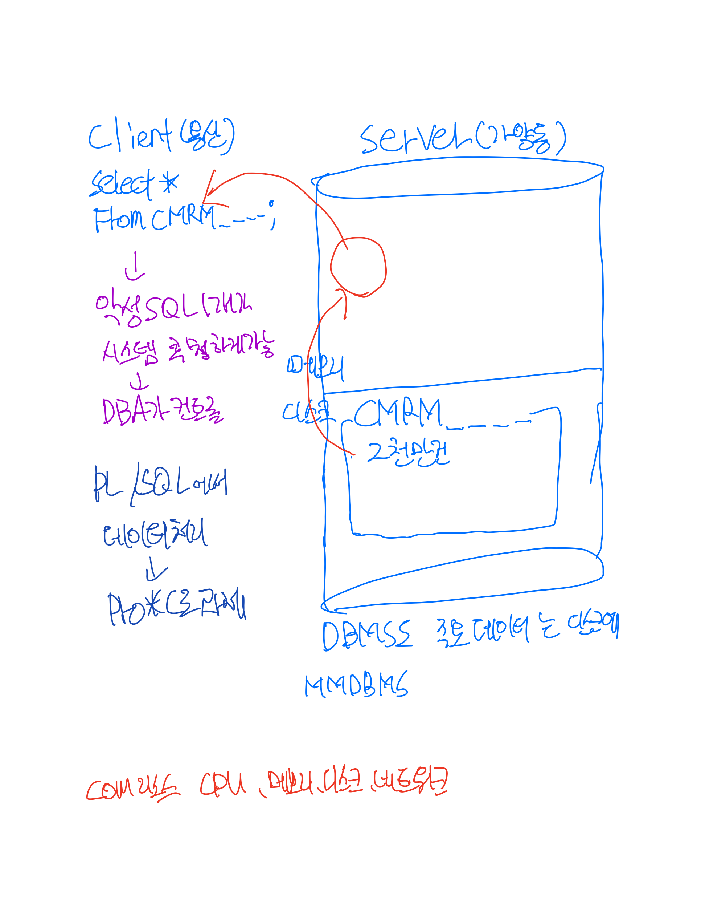

# 20.05.12 sql수업 + 아이패드 필기 확인

[toc]

## 지난 과제 피드백

### 	OLTP , OLAP, DSS ,BATCH

- OLTP 은행9-4시 대면업무시간 실시간으로 처리 건BY건 <-> OLA(분석)P, DSS(의사결정지원시스템) ,<-BATCH(묶	음) 4시 이후 업무처리시간  묶음단위로 업로드

## 수업내용

### 		서브쿼리와 데이터 모델링	

### 	DBMS에서 사용자 바꾸고 비밀번호 바꾸는방법

- 접속에서 + 버튼 누르고 사용자이름 비밀번호 입력하기
- ALTER USER DA16 IDENTIFIED BY 비밀번호; 비밀번호 변경
  SHOW USER; 현재 유저 확인

### 		DML

- DML(Data Manipulation Language)

#### 		INSERT

- [정의] 데이터 조작어 [종류] INSERT UPDATE DELETE MERGE(9i)

- INSERT하고 삭제하면 행이 사라지는게 아니라 NULL로 차있는 행이 남는다 ?

  // 해당 컬럼을 생략하는 경우 NULL로 지정된다. 

  ④ INSERT INTO DEPT VALUES('중부영업점','대구'); // ERROR의 이유는? 

  ⑤INSERT INTO DEPT(DNAME,LOC) VALUES('중부영업점','대구'); // 여전히 ERROR인 이유는? 

  // ORA-01400: NULL을 ("SCOTT"."DEPT"."DEPTNO") 안에 삽입할 수 없습니다. // CONSTRAINT 과정에서 설명

- // INSERT시에 특정 COLUM에 NULL값 삽입방법

  -- EXPLICIT방법 2가지 

  ⑥ INSERT INTO DEPT(DEPTNO,DNAME,LOC) VALUES(52, '북부영업점',NULL); // 'NULL' 과 다른점은? 

  ⑦ INSERT INTO DEPT(DEPTNO,DNAME,LOC) VALUES(53, '남부영업점',''); -- IMPLICIT방법 1가지 

  ⑧INSERT INTO DEPT(DEPTNO,DNAME) VALUES(54,'서부영업점'); // 대상 컬럼 생략 ⑨ SELECT DEPTNO,DNAME,NVL(LOC,'미지정지역') AS LOC FROM DEPT; // 결과 조회 

  ⑩ COMMIT; //변경사항을 DB에 영구히 반영 //TRANSACTION 과정에서 설명


#### 		UPDATE

- UPDATE 테이블명 SET [수정할 컬럼명=수정할값] WHERE~ 특정 데이터를 찾아서 수정하는 방법을 아는 것이 중요하다!!
- 컬럼과 컬럼사이는 ,로 구분하자!!! 
- COMMIT; DBMS에 영구히 반영하겠다
- **③ UPDATE DEPT SET LOC='미개척지역'; // 주의사항: WHERE절 생략시 전체 ROW가 처리됩니다.** -> 전체 데이터를 수정하는 것이다. 
- 수정은 찾아서 수정하는 것
- ROLLBACK; 취소 되돌리기


#### 		DELETE

- 

#### 		MERGE MERGE(9i 의 new feature)

- 합병하다 = 두 연산의 합이다. 
- 데이터가 있으면 INSERT 하고 데이터가 없으면 UPDATE해라
- 닷컴붐 일때 생긴기능 똑같은 데이터가 있으면 업데이트 없으면 인서트
- MERGE 구현 과제


#### 		:star: DML 과 서브쿼리 :star: 보완하기!!!

**스칼라 서브쿼리의 실행 횟수와 방식?**  매번 실행 되는 것이 아니라 똑같은 쿼리가 발생되면 실행결과를 재사용한다 -> 어디에 저장하는지는 CACHE관련?

---

- **SCALAR Subquery** 

한개의 컬럼위치 

[장점] 편리성 [질문] 반복되는 실행을 하는가? 실행횟수 // 입/출력값 , Query Execution Cache , hashing 어러워 보임

 ⑤ 

```sql
SELECT DEPTNO,ENAME,JOB,SAL, (SELECT ROUND(AVG(SAL),0) FROM EMP S WHERE S.JOB=M.JOB) AS JOB_AVG_SAL FROM EMP M ORDER BY JOB; 
```

- 셀렉트 리스트 컬럼 자리에 서브쿼리가 오는것 스칼라 서브쿼리 = 한개의 컬럼을 대체하는 쿼리 

서브쿼리가 먼저 실행 될수없다. 보통의 경우와 반대임!!!! 이경우 JOB을 메인쿼리가 스칼라 서브쿼리로 보내줌 


---

// SUBQUERY로 한번에 여러ROW를 INSERT 합니다. ⑤ INSERT INTO BONUS(ENAME,JOB,SAL,COMM) SELECT ENAME,JOB,SAL,COMM FROM EMP; ⑥ SELECT * FROM BONUS; ⑦ ROLLBACK; // 다음번 실습을 위해서 ⑧ SELECT * FROM BONUS; 

// 부서별로 보너스를 계산한후(데이터 연산) INSERT 작업 ⑨ INSERT INTO BONUS(ENAME,JOB,SAL,COMM) SELECT  ENAME,JOB,SAL,DECODE(DEPTNO,10,SAL*0.3,20,SAL*0.2)+NVL(COMM,0) FROM EMP WHERE DEPTNO IN (10,20); ⑩ SELECT * FROM BONUS; ⑪ COMMIT; ⑫ ROLLBACK;

// 평상시에 COMM을 받지 못하는 사원들에게 평균 COMM 금액의 50%를 보너스로 지급 ⑬ UPDATE EMP SET COMM = (SELECT AVG(COMM)/2 FROM EMP) WHERE COMM IS NULL OR COMM = 0; ⑭ COMMIT; 

// 평균 이상의 급여를 받는 사원들은 보너스 지급 대상자에서 제외 ⑮ DELETE FROM BONUS WHERE SAL > (SELECT AVG(SAL) FROM EMP ; COMMIT; -> 9 내가 원하는 데이터를 바로  서브쿼리로 가공해서 인서트 하는 방식 -> 서브쿼리에도 쓸 수 있다  DML문을

**한번 커밋하면 11번에서 12번에서 롤백 절대 안돼!!** 

13번 WHERE절 COMM이 NULL이거나 0인 사람들 지정 -> SET뒤에 VALUE가 안오고 서브쿼리가 옴 서브쿼리가 단독으로 실행가능 먼저 실행됨  14번 커밋하지말기

15번  

.png)

#### 

#### MMDBMS

- 메인 메모리 데이터 베이스 

#### COMPUTER RESOURCE

CPU, 메모리, 디스크, 네트워크 

가장 성능적 문제는 디스크다 가장 시간이 오래걸림.... -> SSD 비쌈 

서버의 디스크는 모터가 회전하는 HDD 

---

### 		**TRANSACTION**

**A LOGICAL UNIT OF WORK 하나의 논리적인 일의 단위**

DB 모델링 3단계  - 개눈물으로 외워

개념 모델링 

논리 모델링

물리 모델링

[정의]  데이터 베이스의 논리적 연산 단위(?), 밀접히 관련되어서 분리될수 없는 한 개 이상의 데이터 조작 하나의 논리적인 작업단위를 구성하는 세부적인 연산들의 집합

 [특징]  ACID -> 일원고지

**Atomicity** 원자성

**Consistency** 일관성

**Isolation** 고립성

**Durablility** 지속성

##### **일관성** - 어려움

##### **원자성** - ALL OR NOTHING 


- 하면 끝까지하고 안하면 0이다. / 더이상 쪼개지지 않는 최소단위 / 단위! 

##### 고립성 - 더러운거 나만보겠다. 

##### 지속성 - COMMIT 영구적으로 반영 <-> 암시적 반영?() / ROLLBACK 

##### 트랜잭션이 언제 시작되는것 언제 끝나는것을 인지 

**[시작]  - 첫번째 실행가능(변경가능한)한(EXECUTETABLE SQL) SQL 실행시**  변경불가능한 것은 SELECT 다른 SQL들을 BEGIN/END라는 구문이 있으나 오라클은 없어서 헷갈림 주의

 **[종료]  - 명시적 종료 - COMMIT,ROLLBACK  /  암시적 ** - ROLLBACK WORK는 ANSI표준 생략 가능 


COMMIT ~ 트랜잭션에서 변경된 사항을 데이터베이스에 영구히 반영하는 것 ROLLBACK ~ 트랜잭션 시작 이전의 상태로 되돌리는 것 입력/수정/삭제를 취소하고 lock을 해제 SAVEPOINT ~ 저장점, 현재 시점부터 SAVEPOINT까지 트랜잭션의 일부만 ROLLBACK *복잡한 대규모 TRANSACTION에서 에러가 발생했을 때


#### ㅁ


#### ROLLBACK LEVEL

// STATEMENT Level ROLLBACK , SQL*PLUS 에서 실습 ED C:\03_SQL\TST_TRANS.SQL


- 스크립트화 해서 실습

```SQL
① ROLLBACK;
② SELECT /* Before Transaction */ EMPNO,SAL FROM EMP WHERE EMPNO IN (7788,7902);
③ DELETE FROM EMP WHERE DEPTNO = 10;
④ UPDATE /* STATEMENT LEVEL ROLLBACK */ EMP SET SAL = 123456789 WHERE EMPNO = 7788;
⑤ UPDATE EMP SET SAL = 1234 WHERE EMPNO = 7902;
⑥ COMMIT;
⑦ -- 데이터 확인
SELECT /* After Transaction */ EMPNO,SAL FROM EMP WHERE EMPNO IN (7788,7902);
SELECT /* After Transaction */ EMPNO,SAL FROM EMP WHERE DEPTNO = 10;
```

- SQL 문장안에 주석가능 -> 누가한지 확인 가능 원활하게

## 과제 

### 1. OLTP  VS   OLAP=BATCH -> 계정계 VS정보계

- 정보계 와 OLA, BATCH
- 계정계 와 OLAP

### 2.MERGE 구현

- 

### 3.SELECT FOR UPDATE

- ⓒ SELECT ~ FOR UPDATE 의 기능 및 트랜잭션 시작/종료를 설명 하십시요.


### 나증에 할 과제

- PL/SQL에서 데이터 처리 -> PRO*C로 과제 예정


## 교수님 말씀

### 	OLTP , OLAP, DSS ,BATCH

- 은행의 경우 야간에 OLAP, DSS ,BATCH 하는 경우가 많음 거래가 없는 때라서

### PL/SQL

- 주말 과제는 아니고 오전에 수업하고 2시간 8일 오후에 모델링을 할 예정 -> 잠을 줄일 예정 
- PL/SQL에서 데이터 처리 -> PRO*C로 과제 예정

### 데이터 처리 모듈 , HADOOP

- 빅데이터 분석 -> 하둡의 맵리듀스 실행구조!! -> 하둡의 아키텍처도 데이터 이동하지 않고 모듈을 보내서 빠르게 연산가능...!!
- 

## 플젝주제

- 내 프로젝트에서 실시간 번호표는 OLTP 한가한 시간 분석 및 대기 시간은  OLAP - 분석 정산?   
- 정보보안을 프로젝트에 넣고 싶어요 라고 생각하면 프로젝트에 자연스럽게 넣고 자연스럽게 언급!

## 시험언급

 ### 	1

- SQL의 주요 특징 4가지를 쓰고 자세히 설명하시오. 
2. SQL 명령어를 모두 쓰시고 설명하시오. 
3. Connection vs Session을 비교 설명하시오.
4. 트랜잭션의 정의, 원자성과 고립성의 의미를 설명하시오.

### 2

트랙잭션의 특징 4가지 전부 외우고 설명

일관성은 어려워서 안나올 예정

COMMIT ~ 트랜잭션에서 변경된 사항을 데이터베이스에 영구히 반영하는 것 ROLLBACK ~ 트랜잭션 시작 이전의 상태로 되돌리는 것 입력/수정/삭제를 취소하고 lock을 해제 SAVEPOINT ~ 저장점, 현재 시점부터 SAVEPOINT까지 트랜잭션의 일부만 ROLLBACK *복잡한 대규모 TRANSACTION에서 에러가 발생했을 때


## 인지해야 할 상황 & 공지

### 	1

- SQL SCRIPT 사용방법 알아두기

### 2

- 


## 궁금증

### 	체크카드와 신용카드 점검시간

- 12시에 체크카드는 5~!0분 점검시간을 기진다. 신용카드는 사용이 가능하다 일부체크는 가능하고 어떤체크는 불가능하다 점검시간이라고는 하는데 	OLTP , OLAP, DSS ,BATCH=정보계,계정계의 개념으로 이해를 해야 하는가? 