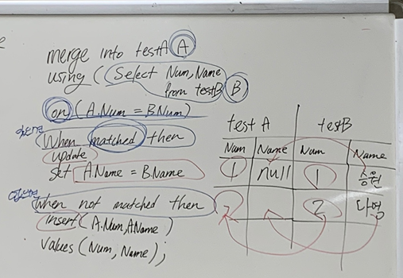
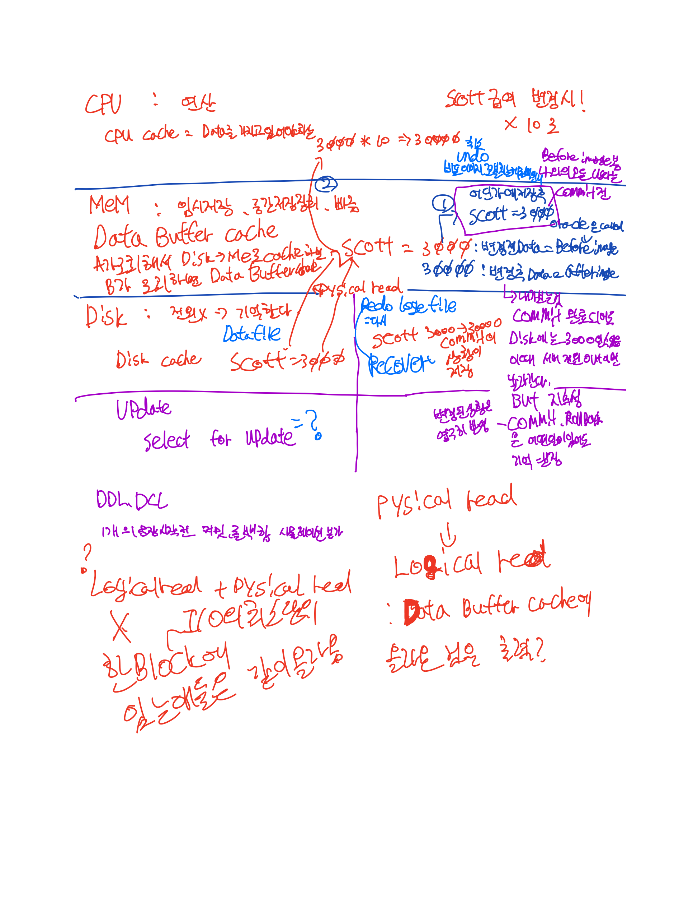
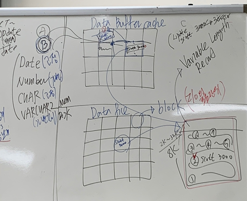
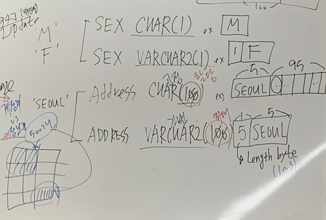

# 20_05_14_sql수업 + 아이패드 필기 확인

[TOC]


## 지난과제

### 1 MERGE

```sql
NUM NUMBER(4),
NAME VARCHAR2(18)
);
SELECT * FROM TESTA;

CREATE TABLE TESTB(
NUM NUMBER(4),
NAME VARCHAR2(18)
);
SELECT * FROM TESTB;

INSERT INTO TESTB VALUES(1, 'SEUNGWON');
INSERT INTO TESTB VALUES(2, 'MINHO');
INSERT INTO TESTA VALUES(1, NULL);
SELECT * FROM TESTA;
SELECT * FROM TESTB;

-- MERGE INTO 시작
MERGE INTO TESTA A 
USING (
    SELECT NUM, NAME FROM TESTB
) B
ON (A.NUM = B.NUM) -- 조인조건 일치여부

-- 이미 존재하는 경우 찾아서 업데이트 해줄 것
WHEN MATCHED THEN
UPDATE 
SET A.NAME = B.NAME


-- 존재하지 않을 경우 새로 추가 해줄 것
WHEN NOT MATCHED THEN
INSERT(NUM,NAME)
VALUES(B.NUM,B.NAME);

SELECT * FROM TESTA;
SELECT * FROM TESTB;


DROP TABLE TESTA;
DROP TABLE TESTB;
```



### 2부서별 급여 차틍지급

### 추가 

과제 제출은 스크립트로!!

### SELECT FOR UPDATE

- ⓒ SELECT ~ FOR UPDATE 의 기능 및 트랜잭션 시작/종료를 설명 하십시요.
- row레벨 락이 걸리는 명령어는 ? 업데이트 딜리트 / 셀렉트는 눈으로 보기만 하는 것!
- update는 sql 업데이트 명령어가 아니라 지금 셀렉하는 데이터를 아무도 건들지마 -> 락이 걸림 
- 레코드 레벨 락걸리는거 
- 내가 지금 select한 데이터를 다른 데이터들이 수정 못하게 하겠다. 나중에 수정하기 위해 그래서 row단위로 락이 걸린다.
- 락의 종류 2가지
- shared lock s-s 가능
- exclusive lock e-e 불가능

## 수업내용

### 트랜잭션과 읽기 일관성 -> 고립성

```sql
--1
update T_EMP set sal=0 where deptno= 10; 
--3
select deptno,ename,sal from T_emp  
where deptno = 10;
--4
COMMIT;
--다른세션
--2
select  deptno,ename,sal from T_emp  
where deptno = 10; --? 3때 실행하면 반영 X
--5
```

- 트랜젝션중인?변경중인? 불안정한 데이터는 세션에만 적용 다른 세션은 변경전의 데이터를 봄
- 이것이 고립성의 증명이다.
- 고립성 레벨 RU,RC,RR,SR 의 등급이 있다.
- 트랙젝션중인 데이터는 

### cache hash

- block은 I/O의 최소단위 
- DATA FILE 은 BLOCK으로 이루어짐  -> BLOCK에 ROW가 저장됨
- DBMS는 DATA BUFFER CACHE존재 
- 같은 BLOCK은 메모리로 같이 올라옴 ROW만 올라올수 없음
- **DBMS들은 VARIABLE LENGTH RECORD=ROW 지원  모든 레코드의 길이는 가변적이다! **
- DATE는 7바이트의 고정길이
- NUMBER 가변길이
- CHAR 고정길이
- VARCHAR2 가변길이 
- **이런 데이터 형식으로 생기는 RECORD는 당연히 가변길이다.** 
- 
- 

### TRANSACTION 과 Row Level Lock 

LOCK 방해받지 않기 위해서..!

```SQL
Connect  scott/tiger 
① update emp set sal=9999 where deptno= 10; 
 
 
④ commit;          -- or  rollback; 

-- 다른세션

 Connect scott/tiger 
 
② delete from emp where deptno = 20; 
③ delete from emp where deptno = 10;  //?? 
 
⑤ rollback;  -- 다음번 test를 위해서… 
```

데이터 수정하기 전에 ROW 레벨 LOCK을 건다.

2번 실행하면 ROW레벨에 락이 걸림 

3번은 안돌아가고 있다가 4번이 되면  3번 진행됩니다.

### DATA TYPE

DATA TYPE의  종류 

#### 문자DATA TYPE 

 작은유형 : CHAR,VARCHAR2 
 긴유형   : LONG 2기가, CLOB 4기가 가변길이  CHARACTER LARGE OBJECT

#### 숫자 DATA TYPE

 NUMBER 

#### 날짜 DATA TYPE 

 DATE,TIMEZONE,.TIMESTAMP

#### BINARY  

미디어 데이터 영상 데이터 거의 안씀
 작은유형: RAW 
 긴유형 : LONG RAW  -> BLOB 4기가 바이너리 라지 오브젝트 - 영화 1편이 디비에 저자장기능 - 비효율적 멀티미디어 회사들은 DBMS안에 멀티미디어 자체를 저장하지 않음 파일로 관리함 DBMS는 파일명,경로정도만 관리 바이너리 데이터를 비싼 DBMS에 넣지 않음 

#### 기타 DATA TYPE


  ROWID - 어렵지만 알아야함 INDEX안에 숨어있음  - 색인=인덱스=책뒤에색인=빠르게 찾으려고=QUICK_SEARCH,정렬,페이지번호->본문으로 감 / DBMS에도 특정 데이터 빠르게 찾을라고 INDEX가 있음 대량의 데이터를 다룰려먼 알아야함 네이버 로그인 할때 아이디 비밀번호를 인덱스로 빠르게 찾음 그것의 페이지 번호가 ROWID 인덱스가 있으니까 빠르네 없으면 느리네 

#### CHAR

**1~2000 사이의 고정길이(fixed-length character strings) 저장 방식** ,  
정의된 길이만큼 저장 공간이 할당이 되며 입력 되고 난 **나머지  공간은 공백문자(BLANK-PADDING)로 채워진다.** 
[용도] 데이터가 항상 지정된 길이를 전부 차지 하는 경우에 유리함.

EX)  SEX            CHAR(1)      // 남녀성별  
SOCIAL_CODE  CHAR(14)     // 주민번호  
EX)  ENAME       CHAR(20)    //  ‘SMITH’가 입력 된 경우 20 Bytes 공간할당 - FM은 프린트할때만

EX )

SEX CHAR(1)  ex - M -> 1바이트

SEX VARCHAR2(1) ex = 1F -> 2바이트

**고정길이가 상대적으로 더 많은 블럭을 차지한다 -> 저장공간<성능튜닝 적은블록에 동일한 데이터를 저장한다 = 성능향상에 주요한 데이터 = I/O의 최소단위-> I/O증가 -> 피지컬리딩증가 -> 데이터버퍼캐쉬 사용 증가 = 메모리 사용 증가 -> CPU연산 증가**  :star2:**모델링 설계하고 테이블 만들때 반영해야함 근본임 이건**



ADDRESS CHAR(100) CHAR - 고정 100-할당 ex) SEOUL 5바이트 / 공백 95바이트

ADDRESS VARCHAR2(100) VARCHR - 고정 100-최대 ex)SEOUL 5바이트 할당 / 나머지는 X /  DBMS먼이 가지고 있는 LENGTH 바이트(1~3)가 있다 -> 5(LENGTHBYTE)SEOUL(5바이트) -> 고로 6~8바이트

#### VARCHAR2

**1~4000 ,가변길이(VARiable-length character strings)저장방식, **
입력된 길이 만큼 저장 공간이 할당된다. (ROW 내부에 길이표시 컬럼 1~3 Bytes) -?
[용도] 대부분의 문자 DATA에 사용  
**[장점] 데이타 저장 공간을 유용하게 사용할수 있다 **
EX)  ENAME   VARCHAR2(20)   // ‘SMITH’가 입력 된 경우  5 BYTES만 공간할당 

#### NUMBER

NUMBER(P,S)  :실수(floating-point-number), 정수(fixed number) ,가변길이(Packed Decimal) 저장.  
  **P(Precision)**  : **1~ 38(전체 유효숫자)   S(Scale):  소수점이하 자리수** 

[실수]      WEIGHT    NUMBER(4,2)  정수자리 2자리 소수점자리 2자리 전체 4자리
[정수]      SALARY    NUMBER(4)  
**[실수,정수]  DCRATE   NUMBER - 좋은 방식이 아니다.** 
**[권고] PRECISION,SCALE을 표시하라 Î 데이타 입력시 INTEGRITY CONSTRAINTS-무결성 제약사황 역할을 한다.            EX)  AGE  NUMBER  Î  AGE  NUMBER(3)** 데이터의 특징에 맞게 넣어야 정제된 정확한 유효한 데이터가 들어와야함 쓰레기 데이터가 들어오면 결과가  쓰레기가 나옴

 NUMBER TYPE의 데이타 저장과 포맷의 관계 
입력값 지정형식 저장값 
1234567.89  NUMBER 1234567.89 
1234567  NUMBER 1234567 
1234567.89  NUMBER(9) 1234568 
1234567.49  NUMBER(9) 1234567 
1234567.89  NUMBER(9,2) 1234567.89 
1234567  NUMBER(9,1) 1234567 
1234567.89  NUMBER(9,1) 1234567.9 
1234567890.89  NUMBER(9,2) ERROR 
123456749.89  NUMBER(9,-2) 123456700 
123456789.89  NUMBER(9,-2) 123456800

#### DATE 

날짜와 시간 정보를 저장하고  연산이 가능하다. (+, - )  
[저장 포맷]        (YY)YYMMDDHHMISS  (고정길이 7bytes , packed decimal)로 저장, 
[Default Date 포맷] RR-MON-YY 
        EX)  SELECT  TO_CHAR(SYSDATE,’YYYY-MM-DD-HH24:MI:SS’) FROM DUAL; 

#### LONG

가변길이 문자형, 1~ 2GIGA BYTES ,VARCHAR2의 특성을 가지고 있다. 
[제약]      TABLE당 1개의 LONG type정의 가능 
SELECT list절에, UPDATE의 SET 절에, INSERT의 VALUE 절에만 사용 
WHERE,GROUP BY,ORDER BY,CONNECT BY,DISTINCT에 사용(X) 
NULL,NOT NULL 제약사항(INTEGRITY CONSTRAINTS)만이 가능하다 
CANNOT BE  INDEXED  
            FUNCTION의 RETURN TYPE 이 될수 없다. 
     SUBSTR,INSTR 사용(X)   
            CREATE  TABLE  AS ~ , INSERT INTO  SELECT ~ 
           
[요구] 
ⓐ 사용상 제약이 많은 LONG type의 대신 CLOB의 정의 및 특징에 대해 조사 

#### RAW

가변길이,RAW BINARY(GRAPHIC,SOUND,DOCUMENTS) DATA TYPE  1~2000 
CAN BE INDEXED

공백 보다 공백문자 데이터 (아스키 0X00)

SELECT ID,REPLACE(ID,'  ', '?'),PWD,REPLACE(PWD,'  ','?')  FROM  CUSTOMER;  REPLACE -> 자주나옴

####  테이블 생성(문자 DATA TYPE) 

#### 고정길이와 가변길이의 차이점 비교

#### 테이블 생성(숫자 DATA TYPE) 

④ DROP   TABLE  TST_NUMBER; 
⑤ CREATE TABLE  TST_NUMBER( 
 NUM  NUMBER,    -- LENGTH가 없는 경우? 
 **AGE  NUMBER(3)  DEFAULT 18,   -- DEFAULT** 
 TAX  NUMBER(7,2) );                                                                                                        													⑥ INSERT INTO TST_NUMBER  VALUES(123.5,123.5,123.5);  -- 실수 소수점자리 초과 -> 반응 비교
⑦ INSERT INTO TST_NUMBER  VALUES(123,  123,123); 
⑧ INSERT INTO TST_NUMBER  VALUES(123,  12345,123);  -- 정수형자리 초과시  - 반응 비교
⑨ INSERT INTO TST_NUMBER  VALUES(123,  123,123.56789);  -- 소수점자리 초과시  - 반응 비교
⑩ INSERT INTO TST_NUMBER  VALUES(123,  '123',123.56789); 
⑪ INSERT INTO TST_NUMBER(ALL_NUM,F_TAX)   VALUES(456,456); - 암시적인 디폴트값
⑫ SELECT  * FROM TST_NUMBER; 

## TRANSACTION TYPE 

규모가 있는 조직은 트랜잭션 처리하는 곳 따로 트랜잭션 분석하는 곳 따로 둠 

계정계에서 트랙잭션 처리하고 있는데 -> 분석하면 딜레이 시스템이 휘청? 발생 가능성 

1. OLPT = 계정계에서 빈번하게 입금출금 동시다발 대량의 트랜잭션
2. OLAP = DSS = BATCH = 정보계에서 빈번하게 새벽에 계정계에서 발생한 데이터를 말아서 정보계로 추출함
3. DTP (DISTRIBUTE)  = 

## 플젝주제

### 플젝에 로그남기는 것이 있어야함!!!!!!!!!!!

- LOG4J

### 트랜잭션

- 규모가 있는 조직은 트랜잭션 처리하는 곳 따로 트랜잭션 분석하는 곳 따로 둠 
- 플젝에서도 트랜쟉션을 말하는것 중요 

## 시험언급 -> 시험 준비.MD

- 수업시간에 배운거 50-60%는 정의하시오! SQL의 특징 같은거
- 5문제 SQL 작성문제 손으로 처음부터 작성...! 테이블 구조는 보여줄듯

## HASH

함수에 값을 넣으면 주소가 나옴 VALUE TO ADDRESS

해쉬는 데이터에 접근하는 가장 빠른 방식이다. 나눗셈 폴딩 등 여려개가 있다.

해시 / 암호화의 차이

해시 - 암호문에서 평문으로 갈수 없다?

암호화 - 

## 조언

자격증은 입사 후 따자

내가 일을 할 수 있는지를 증명하야한다.

