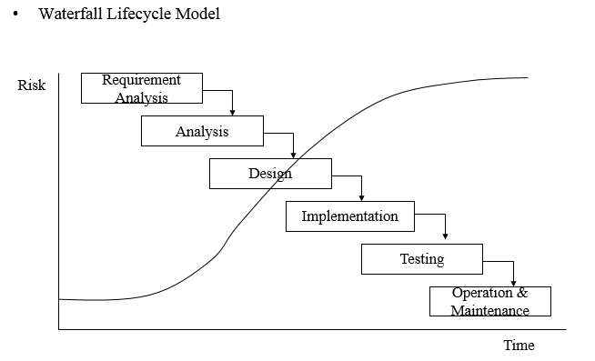
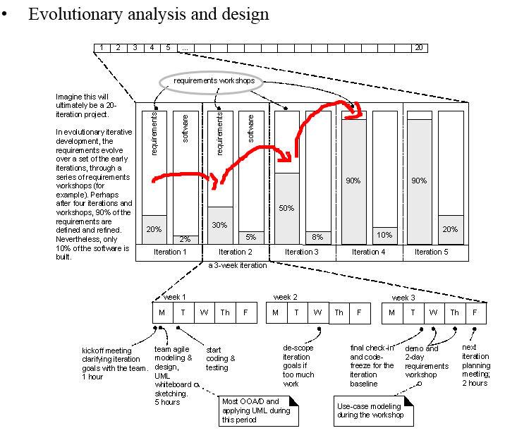

# 20_05_29_수업

비즈니스의 요구사항

이 비즈니스가 뭐야

이 비즈니스로 뭘할꺼야

이런 기본적인 정의 정리가 되여아

모델링이 가능하다 

1차 모델맇 결과를 가지고

6/3 쯤에는 상관모델링을 한다

crud 매트릭스

상관 모델링(상호관계)이란 정보화 시스템을 구축하기 위해 그 업무에 존재하는 무엇 (데이터) 에 대해 무슨 일이 행해지고 (프로세스) 있는지

또는 무슨 일 (프로세스) 에 의해 무엇 (데이터) 이 영향을 받는지 분석하는 방법이다.

**1. CRUD MATRIX 상관 모델링**

표를 만들어서 크로스 체크를 한다.

단위 프로세스가 엔티티타입에 영향을 주는 방법으로는 신규, 조회, 수정, 삭제의 네가지에 반드시 포함되어 있다.

CRUD 는 CREATE-insert 의 "C", READ-select 의 "R", UPDATE 의 "U", DELETE 의 "D" 를 의미한다.

매트릭스 

프로세스 = 내가 만든 프로그램 /  처리과정 / 단위기능모듈

​				엔터티타입

프로세스

## 지금은 분석(what)을 중심으로 분석하자 

추상화 하자

소프트 웨어 개발 방법론

요구사항 분석(무관심, 누락, 오류) = what - 

요구사항 -> 추출 > 분석 -> 명세화 -> 검증 -> 관리 과정을 거친다

추출 

-사람에게 인터뷰를 통해서 텔러 

-문서로부터 추출 - 요구사항 정의서 , erd = 산출물

-시스템(기존에 있는 유사서비스, 경쟁사의 서비스)

요구사항이 변경되면 심각해 

설계 - how - 프로세스

개발

테스트

이행, 릴리즈

운영 & 유지보수

https://jhkang-tech.tistory.com/5

**1.** **폭포수 모델** 

한 단계를 완벽하게 끝내고 그 다음 단계를 진행하는 방식. 이전 단계로 돌아갈 수 없다는 리스크가 있다.

폭포수 개발 방법론이 현실에서 적용이 힘든 이유 다음 단계로 나아가는 방식

\- 특징 : 순차적으로 진행되는 것이 Waterfall 방식이다. 각 단계를 완벽하게 해야 한다.

\- 한계점 : 일이 진행되기 어렵다. 수정사항이 많을 때 변동이 불가능하다.

\- Waterfall 방식은 왜 실패하는가?

1) 큰 프로젝트의 경우 25~30%가 수정이 된다.

2) 계획만 하다가 프로젝트가 끝난다.

하지만 분석에서 요구사항이 누락,무관심,오류되면 다시 돌아가기 힘듦 선형순차적인 방법이라서 그러나 인간이 가장 많이 사용했던 이해하기 쉬운 방식

요구사항이 자꾸 추가,번경

점진 & 반복

**2.** **반복, 점진 모델(Iterative and Incremental Process)**

우선순위가 높은 것(리스크가 큰것)을 먼저 개발하며 동시에 요구사항을 분석, 설계한다. 도중에 수정사항이 요구되면 아직 구현되지 않은 것은 쉽게 수정하고, 구현 되었다면 많이 진행되지 않았기 때문에 개발 도중 수정이 가능하다.

반복 점진 모델의 장점

\- 프로젝트 생산성이 높아지고, 실패율과 결함율이 낮아진다.

\- 진행률을 시각화 하여 볼 수 있다.

\- 복잡도를 관리할 수 있음

\- 반복 주기가 끝날 때 마다 고객으로부터 피드백을 받고 적용할 수 있다.

agile애자일

**
Agile 개발 방법론**

 **- 고정된 기간 내에서 반복적, 진화적 개발 방법**

 **- 수행 가능한 계획 수립**

 **- 점진적인 데모 버전 출시**

 **- 변경에 신속하고 유연하게 대응하는 기민성**

**Agile 선언문(Agile Manifesto)**

\- 프로세스와 도구보다는 상호작용

\- 문서화보다는 제대로 작동하는 소프트웨어 중시

\- 약정된 협상보다는 고객과의 협력

\- 계획에 따르기보다는 변화에 대응. 

**
**

**Agile 원칙**

\- 빠르고 지속적으로 소프트웨어를 출시하여 고객을 만족시키는 것이 최우선순위.

\- 변경된 요구사항을 잘 받아들여야 한다.

\- 기획자와 개발자가 매일 같이 일해야 한다.

\- 가장 효과적이고 효율적인 정보 전달 방법은 개발팀과 얼굴을 맞대고 대화하는 것이다.

**UML : Unified Modeling Language**

\- 소프트웨어 시스템을 상세하고 시각화 하는 언어

문서보다 계약보다 실제 사용자와 변화를 적극 수용하자

어차피 요구사항 바뀔껄 알고 하자

플잭에 개방 방법론을 적용하자

발표도 하고

발표 20분

상관모델링을 했다 누락된 부분을 찾았다 이런 발전하는 부분을 보여주는 이정표

다음주 월요일 

ENTITY 검증하는 방법

집 합성 : 최소한 2개 이상의 속성과 2개 이상의 레코드(인스턴스)

식 별성 : 모든 엔터티는 반드시 고유한 식별자를 가져야 한다.

사 용성 : 우리가 관리 하고자 하는 데이터의 집헙이 엔터티다 엔터티를 사용안하는것은 사용성 고민

영 속성 : 우리가 계속 사용하는 데이터의 집합 <-> 임시적인 한 번만 쓰는 데이터는 위험

관 계성 : RDBMS 우리가 사용하는 모든 DB가 관계성 있음  

ATTRIBUTE 검증

원 자성 :   

단 일값 :

추 출속성 : 인 것은 ATTRIBUTE로 하지마라 언제든지 계산으로 만들수 있으니까 - 중복과 관련

세 상세 :

DB중복의 최소화 

중복이면 보안성,일관성,무결성 경제성 저하 

마지막에 의도적 중복이 있음 성능 문제로

ERD 원본, PDF, JPG

플젝 피티 - 디벨롭 상세 계획서

월요일 오전 6시까지  이거 가지고 모델링 수업할꺼임 이메일로 제출입니다.

차주에 PLSQL로 모델링 한거 함 

다음주 금요일에 모델링 시험 내가 한거 그리기!!!!!!!!!!!

플젝 주제 

개요 주제 디벨롭

생각을 구체화