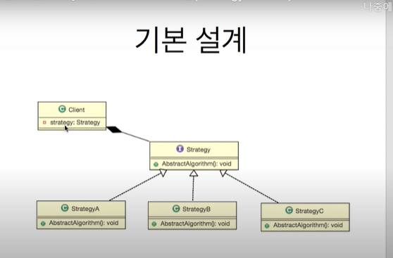

# 디자인패턴

큰시스템을 만들때 변화에 둔감하게 하기 위한 방법론

[객체 지향 프로그래밍](https://namu.wiki/w/객체 지향 프로그래밍) 설계를 할 때 자주 발생하는 문제들을 피하기 위해 사용되는 패턴.

여러 사람이 협업해서 개발할 때 다른 사람이 작성한 코드, 기존에 존재하는 코드를 이해하는 것은 어렵다. 이런 코드를 수정하거나 새로운 기능을 추가해야 하는데 의도치 않은 결과나 버그를 발생시키기 쉽고 성능을 [최적화](https://namu.wiki/w/최적화)시키기도 어렵다. 이로 인해 시간과 예산이 소모된다.

디자인 패턴은 의사소통 수단의 일종으로서 이런 문제를 해결해준다. 예를 들어 문제 해결의 제안에 있어서도 “기능마다 별도의 클래스를 만들고, 그 기능들로 해야할 일을 한번에 처리해주는 클래스를 만들자.”라고 제안하는 것보다 "Facade 패턴을 써보자."라고 제안하는 쪽이 이해하기 쉽다.

일반 프로그래머가 만나는 문제가 지구상에서 유일한 문제[[1\]](https://namu.wiki/w/디자인 패턴#fn-1)일 확률은 거의 없다. 이미 수많은 사람들이 부딪힌 문제다. 따라서 전문가들이 기존에 해결책을 다 마련해 놓았다.

다만 [과유불급](https://namu.wiki/w/과유불급). 디자인 패턴을 맹신한 나머지 모든 문제를 패턴을 써서 해결하려 드는 패턴병에 걸리지 않도록 조심하자. 디자인 패턴보다 중요한 것은 코드베이스의 간결성이다. 즉 디자인 패턴 적용이 굳이 필요가 없을 것 같은 부분은 적용하지 않는게 상책이다. 디자인 패턴은 알고리즘이 아니라 상황에 따라 자주 쓰이는 설계 방법을 정리한 코딩 방법론일 뿐이며 모든 상황의 해결책이 아니다. 디자인 패턴에 얽매이는 것보단 그 패턴이 왜 효율적인 방식인지를 이해해야 한다. 같은 이름의 패턴이 다른 언어로 구현된 모습을 보면 이에 대해 좀 더 쉽게 이해할 수 있을 것이다.

## 1 06_01

인터페이스 

사람과 com을 연결하는 장치

**선언과 구현 분리**

**접근점 제공**

기능의 사용 통로

델리게이트 

**특정객체의 기능을 사용하기 위해 다른 객체의 기능 호출**

위임하다 떠넘기다

두객체와의 관계에서

스트레티지 패턴

여러 알고리즘을 하나의 추상적인 접근점(인터페이스)을 만들어서 접근 점에서 서로 교한 가능 하도록 하는 패턴

프로그램 실행중 모드가 바뀌면 전략이 바뀜

의존주의 디펜던시

매개변수와 관련되어 외부에서 나에게 어떤 것을 주든 묵시적으로 뭐가들어오든 최상위 인터페이스를 통해서만 상속받으면 실행이 가능하도록 쓰는 방법 